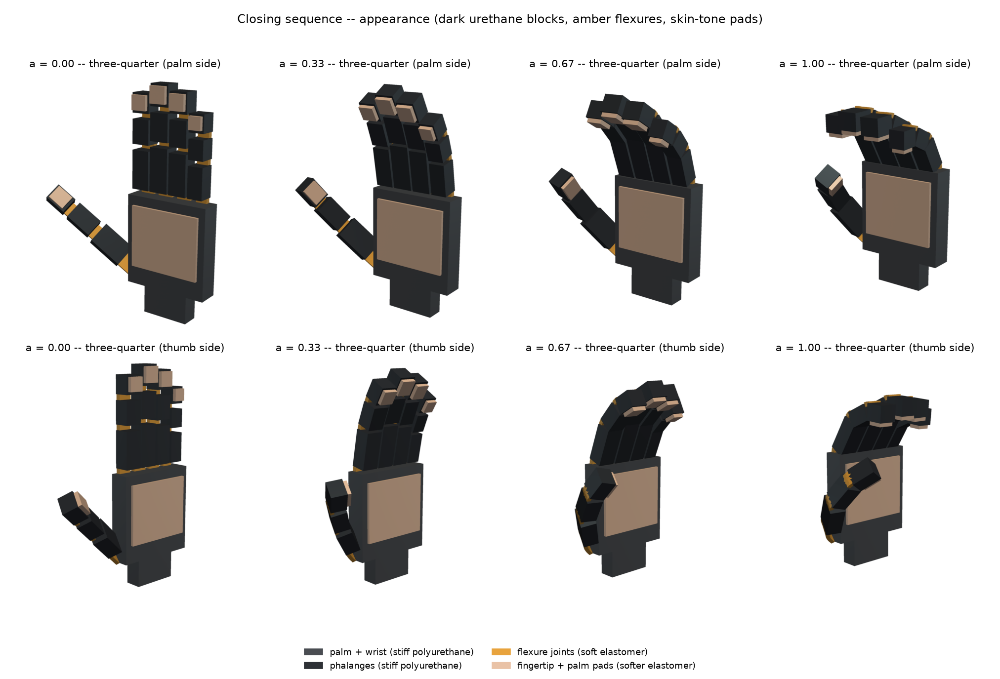

# SDM-style compliant hand: stiff blocks, soft flexure joints, one actuator

A simple geometric FEM model of a tendon-driven compliant hand, built the way
the **SDM Hand** is built (Dollar & Howe, "The Highly Adaptive SDM Hand",
IJRR 2010): stiff polyurethane links joined by thin, soft elastomer flexure
joints, soft pads, and a single actuator that closes every joint. The layout is
anthropomorphic (four 3-phalanx fingers on the top edge of the palm, an
opposable 3-segment thumb on the side), which is the hand shape the user
approved. The original SDM Hand has four 2-link fingers, two opposing two; a
first version of this example modelled that layout and was replaced by this one
at the user's request.



## Pipeline

| step | script | what it does |
|---|---|---|
| 1 | `sdm_geometry.py` | 38 rectangular prisms (`manifold3d.Manifold.cube`) -> per-part OBJs + unified OBJ (`batch_boolean(..., OpType.Add)`); genus check with and without pads; tendon attachment points inserted as surface vertices |
| 2 | `sdm_tets.py` | TetGen (`-pq1.5/10`, background sizing field: 2.2 mm in the flexures, 3.5 mm in pads, 12 mm in the palm) -> per-tet material by libigl generalized winding numbers (pads > flexures > links > palm); genus check of the tet-mesh boundary with and without pads |
| 3 | `sdm_sim.py` | SimKit statics (continuation in `a`) + backward-Euler closing |
| 4 | `sdm_render.py` | all PNGs and the mp4 (pyvista off-screen + matplotlib) |

```bash
cd examples/sdm_hand
python sdm_geometry.py && python sdm_tets.py && python sdm_sim.py && python sdm_render.py
```

Total run time here (4 cores): geometry + meshing ~5 s, statics ~75 s,
dynamics ~220 s, renders + video ~35 s.

## Geometry (metres in the code; mm below)

Frame: `x` across the hand (thumb at -x), `z` along the fingers, `y` the
thickness with the palmar face at `y = 0`.

* palm 90 x 95 x 22 mm; wrist block 50 x 18 x 30 mm below it (its bottom face,
  `z = -30 mm`, is pinned)
* fingers (proximal/middle/distal length, width): index 40/25/20, 19;
  middle 45/28/22, 20; ring 42/26/21, 19; little 32/20/18, 16; phalanx
  thickness 17 mm; ~2 mm gaps
* thumb: metacarpal 38 x 24, proximal 30 x 20, distal 24 x 19 mm (thickness
  16 mm), abducted 50 deg outwards, tilted 15 deg towards the palm, pronated 50
  deg about its axis so its pad faces the fingers
* flexures: 6 mm long, 5 mm thick (thumb 4 mm), 4 mm narrower than the block,
  on the **dorsal** side (so palmar tendons flex the joint); each overlaps both
  blocks by 0.5 mm so the union is one solid. The thumb's first flexure reaches
  16 mm into the palm and the metacarpal keeps 3.4 mm clearance, so that joint
  is a real flexure (in the preview geometry the metacarpal overlapped the palm
  by 481 mm^3, which would have welded it; the code asserts no stiff blocks
  overlap)
* pads: 4 mm thick on the palmar face of every distal phalanx, plus a 76 x 65 x
  3.5 mm palm pad

Assumptions: dimensions are human-hand-like, not measured from the SDM Hand
(its fingers have two 70 mm links). Flexure thickness and length were chosen
so that there are 2-3 tets across a flexure at a modest mesh size.

## Topology (genus) checks

Genus is computed as `g = (2C - chi - B)/2` from V, E, F, connected
components `C` and boundary loops `B`. The code also checks that every edge
has exactly two faces, that the faces around every vertex form one fan, and
that the orientation is consistent. The union is also checked with
`manifold3d.genus()` and `decompose()`.

| mesh | V | E | F | chi | C | B | genus |
|---|---|---|---|---|---|---|---|
| unified surface, no pads | 349 | 1041 | 694 | 2 | 1 | 0 | **0** |
| unified surface, with pads | 427 | 1275 | 850 | 2 | 1 | 0 | **0** |
| tet boundary, no pads (4039 v, 15110 tets) | 2984 | 8946 | 5964 | 2 | 1 | 0 | **0** |
| tet boundary, with pads (5459 v, 21480 tets) | 3723 | 11163 | 7442 | 2 | 1 | 0 | **0** |

The simulated mesh has 5459 vertices and 21480 tets: palm+wrist 6480,
phalanges 8135, flexures 4484, pads 2381.

## Materials

| part | E | nu | rho |
|---|---|---|---|
| palm, wrist, phalanges: stiff polyurethane | 1.5 GPa | 0.35 | 1150 kg/m^3 |
| flexure joints: soft elastomer | 0.6 MPa | 0.45 | 1050 kg/m^3 |
| pads: softer elastomer | 0.2 MPa | 0.45 | 1030 kg/m^3 |

## Physics (SimKit)

* elasticity: `stable_neo_hookean_energy_x / _gradient_x / _hessian_x` with
  `J = deformation_jacobian(X, T)` and `vol = volume(X, T)`. The rest energy is
  subtracted.
* base: the 12 vertices on the wrist's bottom face are pinned by DOF
  elimination.
* tendons: `mass_springs_energy_x / _gradient_x / _hessian_x` (vol = 1). One
  spring on the palmar side across every one of the 15 flexures, anchored at
  exact surface vertices on the stiff blocks, 4 mm from the joint (1.5 mm on
  the distal phalanges, whose pads start at 3 mm). Rest lengths 11.5-14.2 mm,
  moment arms about the flexure 14-16 mm, `k = 1e4 N/m`.
* **one actuator**: `l0_j = (1 - c_j a) l_rest_j` for all 15 springs with a
  single `a in [0, 1]`. `c_j = r_j theta_j / l_rest_j` is a fixed routing
  constant (like pulley radii), set so that at `a = 1` the finger joints flex
  about 32/34/26 deg (base/middle/distal) and the thumb joints about 30/26/26 deg.
  `c_j` ranges from 0.45 to 0.68.
* statics: 13 continuation steps in `a`, Newton (CHOLMOD) + SimKit
  `backtracking_line_search`, with a secant predictor. With a 7500:1 stiffness
  ratio a cold Newton start takes about 50 iterations per step, because
  linearised rotations stretch the stiff blocks. The predictor brings this down
  to 6-13.
* dynamics: backward Euler as the incremental potential
  `V(x) + 1/(2h^2)(x - x~)^T M (x - x~)` with lumped `massmatrix(X, T, rho)`,
  `h = 1/60 s`. `a(t)` is a smoothstep ramp over 1.2 s, then held to 2 s.
  120 steps, 322 Newton iterations.
* gravity is **off** by default (`--gravity` turns it on). The thumb's soft
  root flexure is weak in torsion, and the 36 g thumb would twist about 1 rad
  under its own weight.

## Results

| a | joint flexion (finger base/mid/distal; thumb) | fingertip travel (index, middle, ring, little, thumb) |
|---|---|---|
| 0.33 | 10.7/11.4/8.7 deg; 10.5/8.4/8.4 deg | 32, 36, 34, 28, 34 mm |
| 0.67 | 21.5/22.7/17.5 deg; 21.7/16.8/16.8 deg | 63, 69, 65, 54, 67 mm |
| 1.00 | 32.7/34.1/26.4 deg; 32.8/25.1/25.2 deg | 89, 98, 93, 77, 95 mm |

At `a = 1` each finger has curled about 93 deg in total, and the thumb has
swung in front of the palm towards the index finger (a hook/power-grasp
posture, not a closed fist). Tendon forces stay below about 1.1 N, because the
flexures are soft. The dynamic run ends at the static `a = 1` pose; the thumb
overshoots by about 1 mm and rings slightly after the ramp.

**Interpenetration (no contact model).** Different fingers, the thumb, the
pads and the palm never intersect: winding-number test of every vertex against
every other body's deformed surface, 0 intersecting non-adjacent pairs at all
`a`. The only overlap is the palmar corners of blocks that are joined by a
bent flexure. The flexure gap is 6 mm and the hinge is 16 mm from the palmar
face, so those corners meet at about 21 deg of flexion. At `a = 1` they overlap
by up to 2.8 mm (finger base joints) and 3.8 mm (thumb root). Larger closure
would need contact, or longer or bevelled flexure gaps.

## Outputs (`output/`)

* `parts/*.obj` (38 parts), `sdm_hand.obj` (unified, with pads and anchor
  vertices), `sdm_hand_nopads.obj`
* `geometry_report.json`, `tet_report.json`, `sim_report.json` (all numbers
  above, per-joint tendon data, per-step angles, forces and penetration)
* `renders/`
  * `01_parts_layout.png`: CSG parts and exploded view
  * `02_unified_surface.png`: unified genus-0 surface from 6 angles
  * `03_tet_materials.png`: tet mesh coloured by Young's modulus from 6 angles
  * `04_tet_cutaway.png`: sections showing the flexures and pads inside
  * `05_tendons_pins.png`: tendon springs, anchors, pinned wrist vertices
  * `06_static_poses.png`: `a = 0, 0.33, 0.67, 1` from 3 views
  * `07_static_appearance.png`: same poses in the robot appearance colours
  * `08_closing_curves.png`: joint angles and fingertip travel vs `a` and vs time
  * `09_dynamic_frames.png`: dynamic frames coloured by displacement and von Mises stress
  * `closing_dynamic.mp4`: appearance view next to displacement magnitude
* `sdm_tets.npz`, `sdm_sim.npz`: meshes and trajectories (not committed; regenerate)
